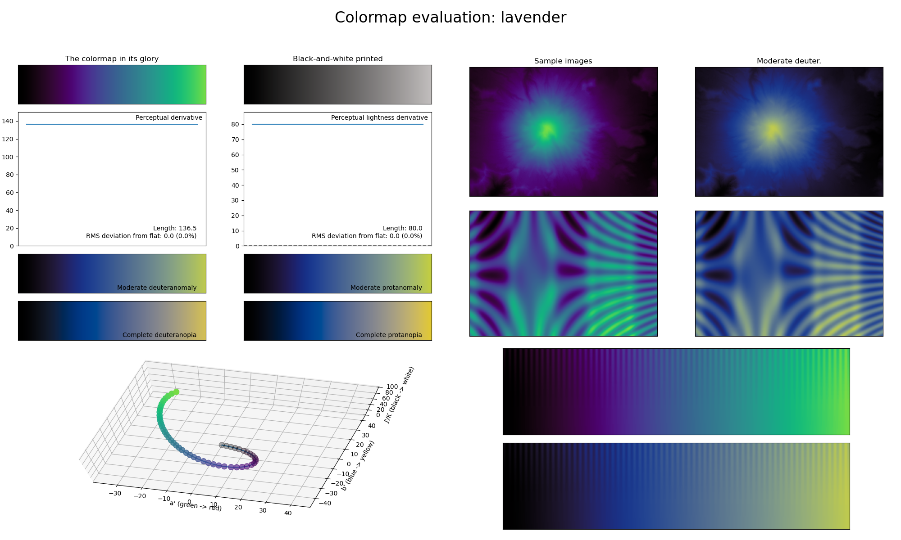

.. _lavender:

lavender
--------

The *lavender* colormap is a visual representation of the flower with the same name.
It covers the :math:`[0, 80]` lightness range and uses the colors green and purple.
Its soft and very distinctive coloring makes it great for representing dense information.
