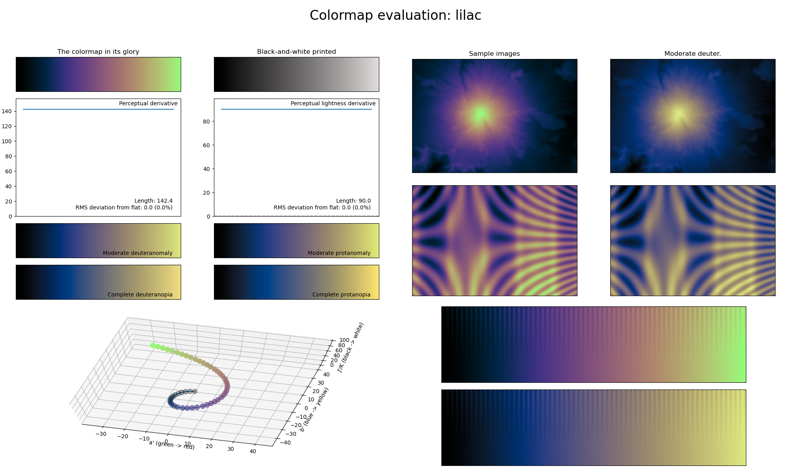

.. _lilac:

lilac
-----

The *lilac* colormap is a visual representation of the flower species with the same name (also known as 'syringa').
It covers almost the full lightness range (:math:`[0, 90]`) and uses the green and purple.
Its smoothly varying colors make it great for representing dense information, whereas the green end also makes it great for representing information where the higher values should be the main focus.
