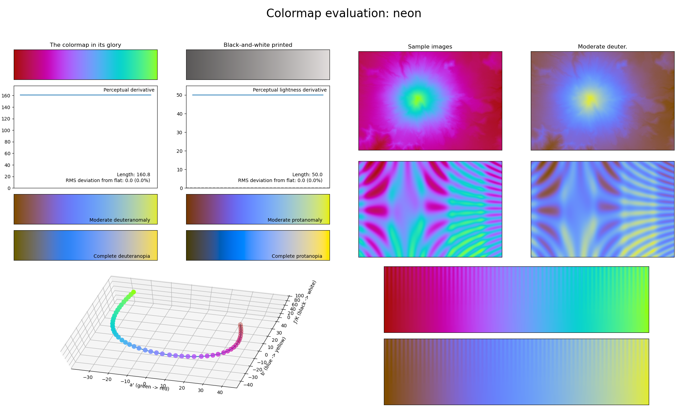

.. _neon:

neon
----

The *neon* colormap is a visual representation of the typical neon signs found in leisure areas.
It covers the very restricted :math:`[40, 90]` lightness range and basically uses all colors.
Its bright colors make it a great alternative to the :ref:`chroma` colormap while being easy to annotate over.
