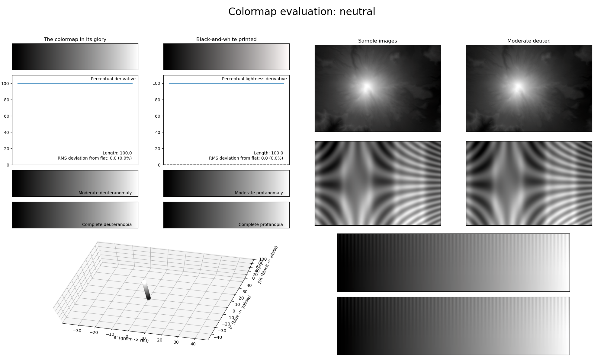

.. _neutral:

neutral
-------

The *neutral* colormap is a neutral, colorless colormap.
It covers the full lightness range and uses no colors.
Whereas MPL's *binary* colormap changes uniformly in colorspace, *neutral* changes uniformly in lightness space.
