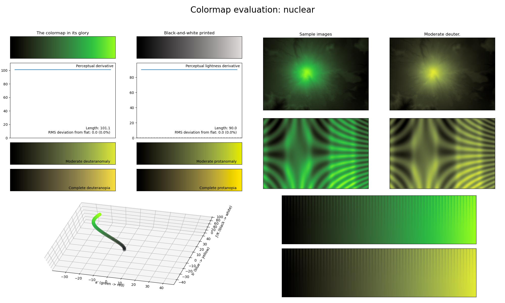

.. _nuclear:

nuclear
-------

The *nuclear* colormap is a visual representation of the colors commonly associated with nuclear radiation.
Keep in mind that this is a misconception, as the Cherenkov radiation coming from a nuclear reactor is usually bright blue, and nuclear/gamma radiation itself is colorless.
It covers the lightness range of :math:`[0, 90]` and uses the color green.
Like other colormaps, it is great at representing smooth information.
