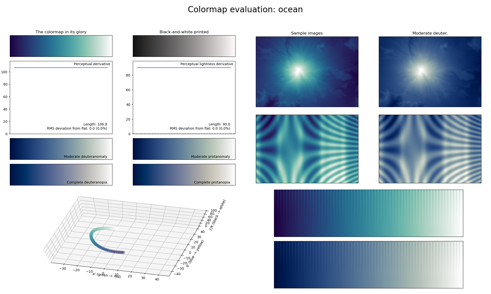

.. _ocean:

ocean
-----

The *ocean* colormap is a visual representation of an ocean wave.
It covers almost the full lightness range (:math:`[10, 100]`) and uses the color green-blue.
Its calming, non-distracting colors make it great for representing background information in a plot.
Note that unlike most other colormaps, *ocean* does not start at :math:`0` lightness.
