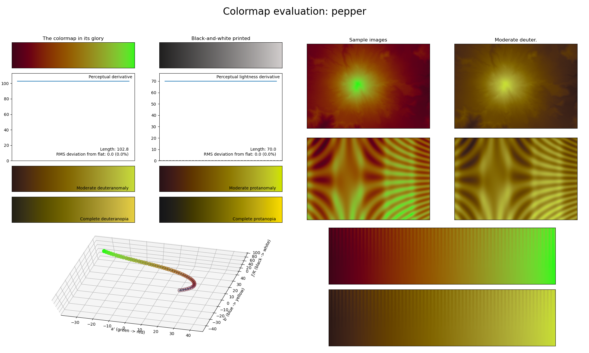

.. _pepper:

pepper
------

The *pepper* colormap is a visual representation of the vegetable with the same name (also known as 'bell pepper'; 'paprika'; 'capsicum'; etc.).
It covers the special :math:`[15, 85]` lightness range and uses the colors red and green.
Like the :ref:`bubblegum` and :ref:`gem` colormaps, *pepper* is excellent for representing discrete information and can easily be annotated over due to its low perceptual range and unique lightness range.
