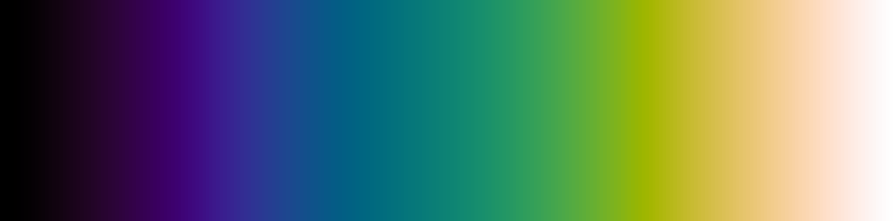
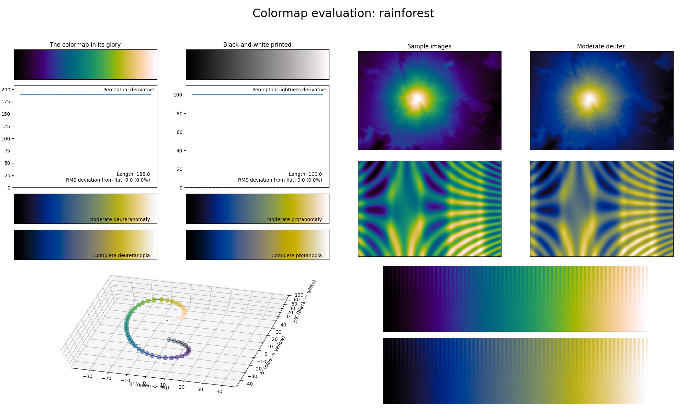

.. _rainforest:

rainforest
----------

The *rainforest* colormap is one of the two main colormaps used in `PRISM`_, and is a visual representation of Mother Nature, in particular a dense rainforest (with blue representing the water; green the trees/plants; and yellow/red the Sun).
It covers the full lightness range and uses basically all major colors (red might be hard to see) as it was created by an attempt to improve the *jet* colormap.
Because it uses all major colors, this colormap has a high perceptual range, making it excellent for representing information where small adjacent differences should be clearly visible.
This also makes *rainforest* a good standard colormap choice as it treats all information as equally important, in addition to being CVD-friendly.

.. _PRISM: https://github.com/1313e/PRISM
