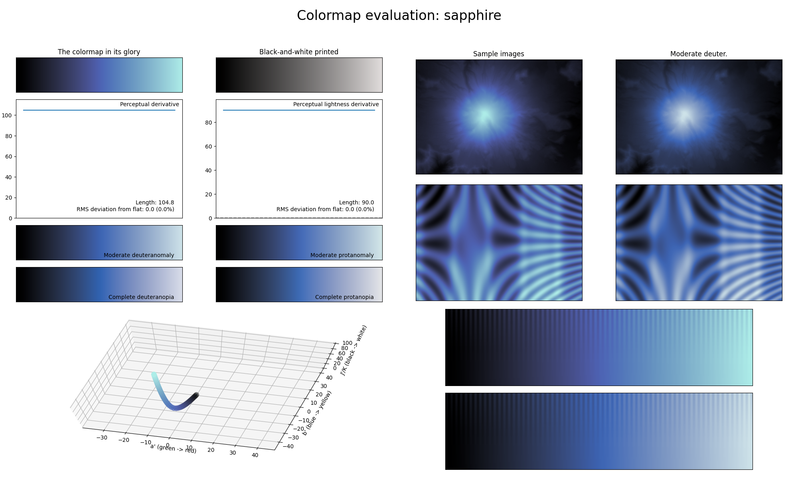

.. _sapphire:

sapphire
--------

The *sapphire* colormap is a visual representation of the gemstone with the same name.
It covers the :math:`[0, 90]` lightness range and solely uses the color blue.
As with other single-major color colormaps, *sapphire* is excellent for representing smooth data.
