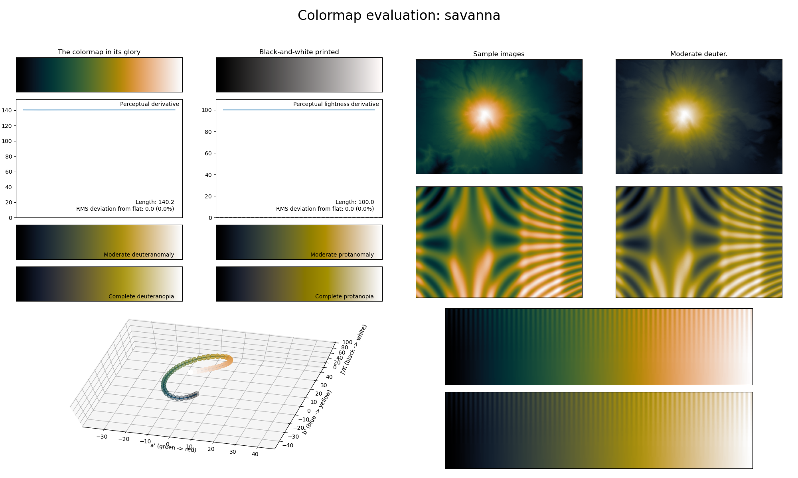

.. _savanna:

savanna
-------

The *savanna* colormap is a visual representation of the tropical savanna ecosystems.
It covers the full lightness range and uses the colors green and orange.
As with a few other colormaps, its smoothly varying colors makes *savanna* great for intensity maps.
Note that the colors in *savanna* are chosen such to still be CVD-friendly.
