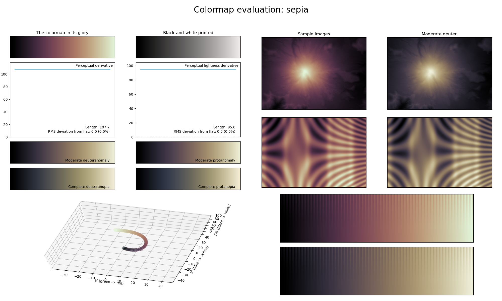

.. _sepia:

sepia
-----

The *sepia* colormap is a visual representation of the sepia toning often used in photography.
It almost covers the full lightness range (:math:`[0, 95]`) and uses many shades of the color brown.
Its soft and non-distracting colors make it great for representing background information.
