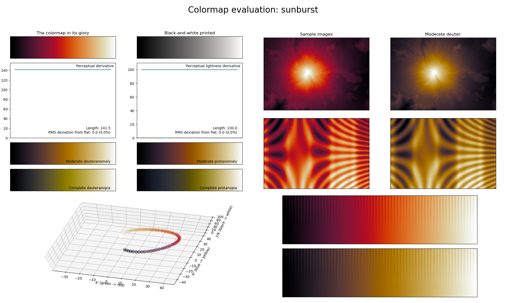

.. _sunburst:

sunburst
--------

The *sunburst* colormap is a visual representation of a sunburst or solar flare.
It covers the full lightness range and uses the colors red and orange.
Its smoothly varying coloring makes it a good choice for representing data that varies smoothly as well (like intensity or temperature maps).
