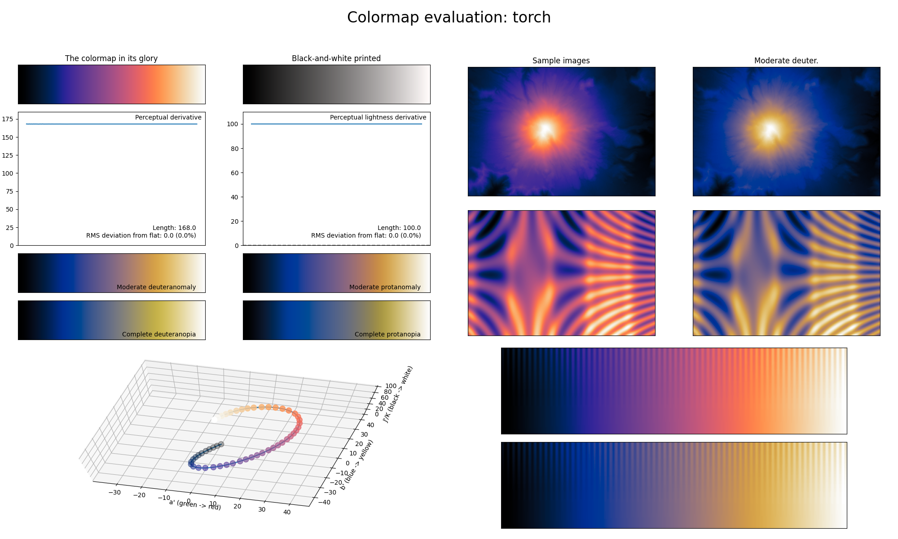

.. _torch:

torch
-----

The *torch* colormap is a visual representation of the typical blue/orange gas flame produced by torches or burners.
It covers the full lightness range and mainly uses the colors blue/purple and orange.
It should mainly be used for representing information where the center values are important.
