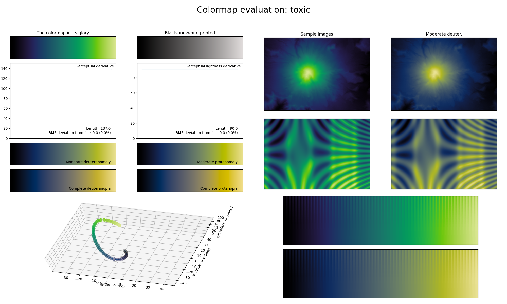

.. _toxic:

toxic
-----

The *toxic* colormap is a visual representation of the colors commonly associated with toxic substances.
It covers the :math:`[0, 90]` lightness range and uses the colors blue and green.
As with :ref:`lavender` and :ref:`gem`, it is great at representing dense information.
