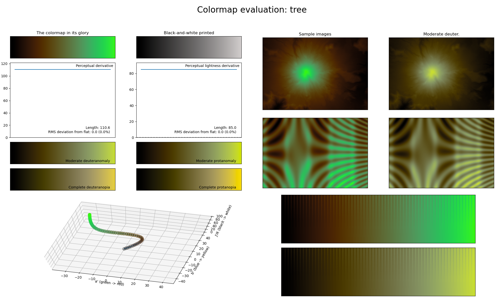

.. _tree:

tree
----

The *tree* colormap is a visual representation of the woody plants with the same name (there is, funnily enough, no accepted definition of what a `tree <https://en.wikipedia.org/wiki/Tree>`__ is).
It covers the :math:`[0, 85]` lightness range and uses the colors green and brown.
This colormap is excellent for representing information where the higher values should be the main focus.
