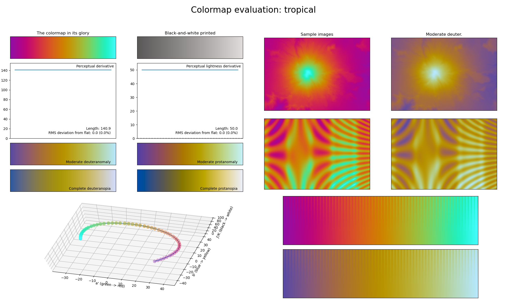

.. _tropical:

tropical
--------

The *tropical* colormap is a visual representation of the tropical colors of beach parties and flower leis.
It covers the very restricted :math:`[40, 90]` lightness range and basically uses all colors.
As the counterpart to the :ref:`neon` colormap, its bright colors make it a great alternative to the :ref:`chroma` colormap while being easy to annotate over.
