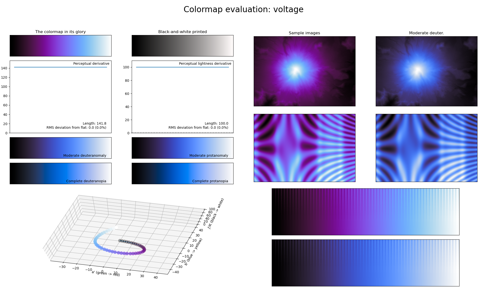

.. _voltage:

voltage
-------

The *voltage* colormap is a visual representation of the high voltage electricity in a tesla coil or lightning strike.
It covers the full lightness range and uses the colors purple and blue.
As with :ref:`arctic` and :ref:`freeze`, it is excellent at representing information that is smooth.
This colormap is also a great alternative to the :ref:`gem` colormap, as it uses softer colors.
