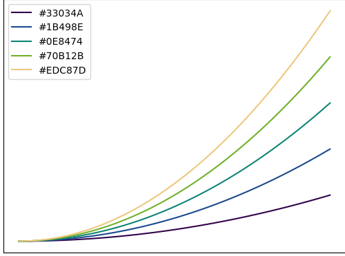

.. _usage:

Usage
=====
The following contains explanations on how the different functions in *CMasher* can be used to aid the creation of *cmashing* plots.

Accessing colormaps
-------------------
All *CMasher* colormaps are available through *matplotlib* and *CMasher* upon importing the package, but *CMasher* also provides a few other ways of using the colormaps.

If one wishes to use a specific *CMasher* colormap without adding dependencies (useful for, e.g., handing in tutorial assignments; quickly sharing work/results with someone; etc.), then one can create a standalone Python module of the colormap with :func:`~cmasher.create_cmap_mod`.
The created Python module can be placed in a local working directory, and can then be imported with :pycode:`import <cmap_name>` (e.g., :pycode:`cmr.create_cmap_mod('rainforest')` to create standalone module of :ref:`rainforest`; and `:pycode:`import rainforest` to register the colormap in *matplotlib* as ``'cmr.rainforest'``).
Premade standalone versions of all colormaps in *CMasher* can be found in the `cmasher/colormaps`_ directory, with the name ``<cmap_name>/<cmap_name>.py``.

Accessing the colormaps in other languages than *Python* would require reading in the ``<cmap_name>/<cmap_name>_8bit.txt`` text files in the `cmasher/colormaps`_ directory, which contain the 8-bit RGB values of every colormap, and registering them in the appropriate package in the language manually.
For those that are interested, the *viscm* source files that were used for creating the colormaps can also be found in the `cmasher/colormaps`_ directory in the repo (the source files are not provided with the package distribution).
Note that my modified version of *viscm* (available `here <https://github.com/1313e/viscm>`_) is required in order to properly view and edit the source file of a diverging colormap.

Colormap overviews
------------------
To allow for colormaps to be more easily compared with each other, *CMasher* can create colormap overviews of a given collection of colormaps, like those shown on the :ref:`introduction`; :ref:`sequential`; and :ref:`diverging` pages.
This is done with the :func:`~cmasher.create_cmap_overview` function, which takes a list of colormaps, and creates an overview with their colored and grey-scaled versions, sorted on type and name (by default).
Colormap overview figures are ideal for webpages or documents, as their horizontal resolution is always the same (i.e., 640px for SVG, or 1,600px for other formats).
Adding or removing colormaps from the overview solely affects its vertical resolution, which is adjusted automatically such that each entry always has the same resolution.

The colormaps shown in an overview can be sorted/ordered in a number of different ways.
By default, the colormaps are separated into their types (as determined by :func:`~cmasher.get_cmap_type`), and sorted on their name in alphabetical order (use :pycode:`sort=None` to not sort the colormaps).
However, one can specify their own categories for colormaps (that are used instead of the colormap types) by providing a dict of lists, where the keys are used as the categories.
As colormaps with different lightness profiles can cause perception issues when displayed near each other, colormaps can also be sorted on their lightness profiles with :pycode:`sort='lightness'` to avoid this problem.

Additionally, by using :pycode:`plot_profile=True`, one can plot the lightness profile of all colormaps (except those that are classified as 'qualitative') on top of their grey-scaled versions, allowing for quick performance comparisons between colormaps.
And, finally, one can set the title that is displayed at the top of the colormap overview with the `title` argument, which by default is set to :pycode:`"Colormap Overview"`.

Below is a list of pages containing several colormap overview examples with their scripts.

.. toctree::

    cmap_overviews/cmr_cmaps
    cmap_overviews/categories
    cmap_overviews/mpl_cmaps
    cmap_overviews/seq_mpl_cmaps

Command-line interface (CLI)
----------------------------
Although *CMasher* is written in Python, some of its utility functions do not require the interpreter in order to be used properly.
For that reason, *CMasher* provides a CLI that allows for these utility functions to be called directly from the command-line.
This CLI can be accessed with the command ``cmr`` after installing *CMasher*.
The table below shows which CLI commands are available and what utility function in *CMasher* they correspond to.

+--------+-------------------------------------------------------+
|Command |Function                                               |
+========+=======================================================+
|bibtex  |:func:`~cmasher.get_bibtex`                            |
+--------+-------------------------------------------------------+
|cmcolors|:func:`~cmasher.take_cmap_colors`                      |
+--------+-------------------------------------------------------+
|cmtype  |:func:`~cmasher.get_cmap_type`                         |
+--------+-------------------------------------------------------+
|mkcmod  |:func:`~cmasher.create_cmap_mod`                       |
+--------+-------------------------------------------------------+
|rgbtable|:func:`~cmasher.take_cmap_colors` with :pycode:`N=None`|
+--------+-------------------------------------------------------+

Except for the `mkcmod` command, the commands print their results directly to the console using the formatting that was requested (if applicable).
Depending on the operating system used, this output can easily be redirected to be saved to a file (e.g., ``cmr bibtex > bibliography.bib`` to save the BibTeX entry in a ``.bib``-file on UNIX-systems).
All functionality that is usually available for the listed functions within the interpreter, are also available from the command-line.

Custom colormaps
----------------
*CMasher* allows for custom colormaps to be imported with the :func:`~cmasher.import_cmaps` function (which is executed automatically on the `cmasher/colormaps`_ directory when *CMasher* is imported).
This function takes the path to a colormap file named ``cm_<cmap_name>`` (or the path to a directory containing such files); creates a :obj:`~matplotlib.colors.ListedColormap` object using the data in the file; and registers it in *matplotlib* with the name ``'cmr.<cmap_name>'`` (it will also be available in *CMasher* as :pycode:`cmr.cm.<cmap_name>`).
A colormap file can either be a JSCM-file as created by *viscm* or a text file that contains the (normalized) RGB values of the colormap (see the text files in the `cmasher/colormaps`_ directory for the structure of such files).
If one wishes to register a colormap using (normalized) RGB values that are already in memory, the :func:`~cmasher.register_cmap` function can be used for this.

Note that colormaps imported/registered this way cannot be accessed through *CMasher* using :pycode:`cmr.<cmap_name>`, unlike *CMasher*'s own colormaps, but solely using :pycode:`cmr.cm.<cmap_name>` (access through *matplotlib* is the same as before).
This is to keep official and unofficial colormaps separated in *CMasher*.

Legend entries
--------------
In *matplotlib*, it is possible to assign labels to plots that use colormaps.
However, in many of these cases, it will not create an entry in the legend, as colormaps do not have legend icons.
As it can sometimes be desirable to add a colormap as an entry to the legend, for example when plotting a 2D histogram as background information in a figure, *CMasher* provides the :func:`~cmasher.set_cmap_legend_entry` function.
This function can be used to set the label of any *matplotlib* plotting element (instances of the :class:`~matplotlib.artist.Artist` class) that uses a colormap, and adds a miniature version of the colormap to the legend.
The script and image below show an example of this::

    # Import packages
    import cmasher as cmr
    import matplotlib.pyplot as plt
    import numpy as np

    # Create figure object
    fig = plt.figure()

    # Generate some data to plot
    x = np.random.rand(1000000)
    y = np.random.rand(1000000)
    z = x**2+y**2

    # Create hexbin plot using the rainforest colormap
    plot = plt.hexbin(x, y, z, 50, cmap='cmr.rainforest')

    # Add legend entry
    cmr.set_cmap_legend_entry(plot, 'rainforest')

    # Obtain axes object
    ax = fig.axes[0]

    # Set axes limits
    ax.axis([0, 1, 0, 1])

    # Turn off the X and Y axes
    ax.set_axis_off()
    ax.xaxis.set_visible(False)
    ax.yaxis.set_visible(False)

    # Create legend
    ax.legend(loc='upper left')

    # Show figure
    plt.show()

.. figure:: images/cmap_legend_entry.png
    :alt: Hexbin plot using a colormap legend entry.
    :width: 100%
    :align: center

    Hexbin plot using a colormap legend entry for the :ref:`rainforest` colormap.

Sub-colormaps
-------------
Most sequential colormaps in *CMasher* span the entire lightness range from black to white, to maximize the perceptual range of the colormap.
However, there are many cases in which this is not necessary or is even counter-productive (e.g., annotating colormaps; displaying smooth information like images; etc.).
To aid with this, *CMasher* allows for sub-colormaps to be made of any colormap with the :func:`~cmasher.get_sub_cmap` function.
Below is an example of a sub-colormap of :ref:`rainforest` using the central :math:`70\%`, created with :pycode:`cmr.get_sub_cmap('cmr.rainforest', 0.15, 0.85)`, compared to the original:

    The :ref:`rainforest` colormap.

.. figure:: images/rainforest_sub.png
    :alt: The *rainforest* sub-colormap.
    :width: 100%
    :align: center

    The sub-colormap made of :ref:`rainforest`, using its central :math:`70\%`.

Note that :func:`~cmasher.get_sub_cmap` does not interpolate between colors, as this can create artifacts.
In order to avoid creating colormaps that have too few different colors to look smooth, it is recommended to include at least 128 different colors.
For *CMasher* colormaps, this means that one should aim to use at least :math:`50\%` of sequential colormaps (256 colors), or :math:`25\%` of diverging colormaps (511 colors).

Taking colormap colors
----------------------
Sometimes it is necessary to show a collection of different plots in the same figure.
For example, several scatter plots that indicate sample populations; or a set of lines where each uses a different fitting algorithm; etc.
In this case, it is often desirable to choose colors for these different plots that are distinguishable, but still follow some sort of relative ordering.
As colormaps contain colors in an ordered structure, they are well suited for this.

*CMasher* allows one to take a given number of equally spaced colors from any colormap with the :func:`~cmasher.take_cmap_colors` function.
These colors can then be used during plotting.
The example below shows the script used to create a line plot with 5 colors taken from the :ref:`rainforest` colormap, and the resulting figure::

    # Import packages
    import cmasher as cmr
    import matplotlib.pyplot as plt
    import numpy as np

    # Create figure object
    fig = plt.figure()

    # Take 5 colors from rainforest in [0.15, 0.85] range in HEX
    colors = cmr.take_cmap_colors('cmr.rainforest', 5, cmap_range=(0.15, 0.85), return_fmt='hex')

    # Create 5 line plots, each using a different color
    for i, color in enumerate(colors):
        x = 0.1*(i+1)*np.linspace(0, 1, 100)**2
        plt.plot(x, color=color, label=color)

    # Obtain axes object
    ax = fig.axes[0]

    # Turn off the X and Y axes
    ax.xaxis.set_visible(False)
    ax.yaxis.set_visible(False)

    # Create legend
    ax.legend(loc='upper left')

    # Show figure
    plt.show()

    Line plot using 5 different colors from the :ref:`rainforest` colormap.

.. _viscm: https://github.com/matplotlib/viscm
.. _repository: https://github.com/1313e/CMasher
.. _PyPI: https://pypi.org/project/CMasher
.. _matplotlib: https://github.com/matplotlib/matplotlib
.. _issue: https://github.com/1313e/CMasher/issues
.. _cmasher/colormaps: https://github.com/1313e/CMasher/tree/master/cmasher/colormaps
