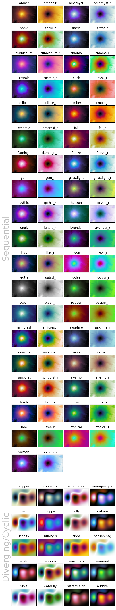

.. _usage:

Usage
=====
The following contains explanations on how the different colormaps and functions in *CMasher* can be used to aid the creation of *cmashing* plots.

.. _accessing_colormaps:

Accessing colormaps
-------------------
All *CMasher* colormaps are available through *matplotlib* and *CMasher* upon importing the package as shown in :ref:`example_use` and a list of all available colormaps can be obtained with :func:`~cmasher.get_cmap_list`, but *CMasher* also provides a few other ways of using the colormaps.

If one wishes to use a specific *CMasher* colormap without adding dependencies (useful for, e.g., handing in tutorial assignments; quickly sharing work/results with someone; etc.), then one can create a standalone Python module of the colormap with :func:`~cmasher.create_cmap_mod`.
The created Python module can be placed in a local working directory, and can then be imported with :pycode:`import <cmap_name>` (e.g., :pycode:`cmr.create_cmap_mod('rainforest')` to create a standalone module of :ref:`rainforest`; and :pycode:`import rainforest` to register the colormap in *matplotlib* as ``'cmr.rainforest'``).
Premade standalone versions of all colormaps in *CMasher* can be found in the `cmasher/colormaps`_ directory, with the name ``<cmap_name>/<cmap_name>.py``.

.. note::

    Standalone Python modules can only be made with :func:`~cmasher.create_cmap_mod` of colormaps that are registered in *CMasher* (see `Custom colormaps`_).
    This is because these modules contain metadata that states where the colormap comes from, and there is no consistent way to obtain this metadata for colormaps not coming from *CMasher*.

Accessing the colormaps in other applications or languages other than Python would require reading in the ``<cmap_name>/<cmap_name>_norm.txt``; ``<cmap_name>/<cmap_name>_8bit.txt``; or ``<cmap_name>/<cmap_name>_hex.txt`` text files in the `cmasher/colormaps`_ directory, which contain the normalized; 8-bit; and HEX-code RGB values of every colormap, respectively, and registering them in the appropriate package in the language or application manually.
These RGB values can also be obtained with the :func:`~cmasher.take_cmap_colors` function using :pycode:`N=None` and providing the appropriate format string for the `return_fmt` argument.

Below is a list of pages with instructions for using *CMasher* in several other applications and languages, provided to me by wonderful members of the community.
*CMasher* provides functions for porting its colormaps to certain applications in the :mod:`~cmasher.app_usage` module.
If your application or language of choice is not in this list, feel free to open an `issue`_ about it or create a tutorial for it yourself such that it can be added.

Applications
++++++++++++
.. toctree::

    app_usage/Tableau

Languages
+++++++++
.. toctree::

    lang_usage/R

For those that are interested, the *viscm* source files that were used for creating the colormaps can also be found in the `cmasher/colormaps`_ directory in the repo (the source files are not provided with the package distribution).
Note that my modified version of *viscm* (available `here <https://github.com/1313e/viscm>`_) is required in order to properly view and edit the source file of a diverging or cyclic colormap.

Colormap overviews
------------------
To allow for colormaps to be more easily compared with each other, *CMasher* can create colormap overviews of a given collection of colormaps, like those shown on the :ref:`introduction`; :ref:`sequential`; and :ref:`diverging` pages.
This is done with the :func:`~cmasher.create_cmap_overview` function, which takes a list of colormaps, and creates an overview with their colored and gray-scaled versions, sorted on type and name (by default).
Showing the grayscale versions of the colormaps can be turned off with :pycode:`show_grayscale=False`.
Colormap overview figures are ideal for webpages or documents, as their horizontal resolution is always the same (i.e., 640px for SVG, or 1,600px for other formats).
Adding or removing colormaps from the overview solely affects its vertical resolution, which is adjusted automatically such that each entry always has the same resolution.
Using :pycode:`show_grayscale=False` and/or setting the `wscale` and `hscale` arguments will modify this resolution accordingly.

The colormaps shown in an overview can be sorted/ordered in a number of different ways.
By default, the colormaps are separated into their types (as determined by :func:`~cmasher.get_cmap_type`), and sorted on their name in alphabetical order (use :pycode:`sort=None` to not sort the colormaps).
However, one can specify their own categories for colormaps (that are used instead of the colormap types) by providing a dict of lists, where the keys are used as the categories.
As colormaps with different lightness profiles can cause perception issues when displayed near each other, colormaps can be sorted on their lightness profiles with :pycode:`sort='lightness'` to avoid this problem.
If required, the colormaps can also be sorted on their perceptual range in addition to their lightness profiles with :pycode:`sort='perceptual'`, which makes it easier to distinguish colormaps with high color variation from those with low color variation.
Keep in mind that sorting on lightness profiles is only useful if all colormaps within a category are of the same colormap type, and sorting on perceptual range only makes sense if all colormaps are perceptually uniform sequential.

.. note::

    Sorting colormaps on their lightness profiles is done roughly in the following order:

    1. Sequential colormaps are split up into four groups based on their minimum and maximum lightness values.
       These groups are :math:`[0, {<}100]`; :math:`[0, 100]`; :math:`[0{<}, 100]`; and :math:`[0{<}, {<}100]`.
    2. Starting (sequential) or central (diverging and cyclic) lightness value.
    3. Difference between the minimum and maximum lightness values.
    4. RMSE (root mean square error) of the derivative of the lightness profile.
    5. Name.

    Qualitative and miscellaneous colormaps are never sorted on their lightness profiles and solely use the last step.

Additionally, by using :pycode:`plot_profile=True`, one can plot the lightness profile of all colormaps (except those that are classified as 'qualitative') on top of their gray-scaled versions, allowing for quick performance comparisons between colormaps.
Another way of comparing colormaps can be obtained with :pycode:`show_info=True`, which shows three numbers below the name of each colormap, representing the starting/central lightness value; the final/outer lightness value; and the perceptual range of that colormap, respectively.
Both of these options make it significantly easier to find a colormap that suits your application, where especially the latter can be quite helpful, as it shows you the lightness range of the colormap (as usually reported on the individual colormap pages in these docs) and the perceptual range.
The perceptual range is a measure of how much color variation there is in the colormap, with higher values implicating that there is more color in the colormap.
This information is provided in the :ref:`cmap_overview_perceptual` overview and the overviews on the :ref:`sequential` and :ref:`diverging` pages.

For those that want to show a colormap overview on a page that usually uses dark mode or simply want to have a dark background instead of a white background in the overview, one can enable dark mode in the overview by using :pycode:`dark_mode=True`.
An example of dark mode is shown in the :ref:`cmap_overview_categories` overview.
And, finally, one can set the title that is displayed at the top of the colormap overview with the `title` argument, which by default is set to :pycode:`"Colormap Overview"`.

Below is a list of several colormap overview examples with their scripts:

.. toctree::

    cmap_overviews/cmr_cmaps
    cmap_overviews/categories
    cmap_overviews/mpl_cmaps
    cmap_overviews/seq_mpl_cmaps
    cmap_overviews/single_major

Colormap application overview
-----------------------------
Whereas the colormap overviews introduced above are great for seeing how the colormaps compare to each other in terms of performance, they do not show how the colormap would look like when used in a realistic application.
As *CMasher* has quite a few different colormaps, this could make it difficult to pick the right one.
For that reason, below is an overview of all colormaps in *CMasher* (and the reversed/shifted versions of all sequential/cyclic colormaps as well), using their sample images as usually shown on the individual colormap pages:

    Application overview plot of *CMasher*'s colormaps.

.. _combine_colormaps:

Combine colormaps
-----------------
*CMasher* offers a utility function :func:`~cmasher.combine_cmaps`, which enables the combination of multiple colormaps at specified ``nodes`` (where a node denotes the point separating adjacent colormaps, within the interval [0, 1]). You can directly pass several colormaps using the function like so :pycode:`combine_cmaps("cmr.rainforest", "cmr.torch_r")`. By default, each sub-colormap occupies an equal portion of the final colormap.

    Combine two colormaps with default equal separation.

Alternatively, you may want to specify ``nodes`` explicitly. For example :pycode:`cmr.combine_cmaps("cmr.rainforest", "cmr.torch_r", nodes=[0.75])` would allocate the starting 75% of the final colormap to "cmr.rainforest"and the remaining 25% to "cmr.torch_r".

    Combine two colormaps with a 75%/25% separation.

Command-line interface (CLI)
----------------------------
Although *CMasher* is written in Python, some of its utility functions do not require the interpreter in order to be used properly.
Therefore, *CMasher* provides a CLI that allows for these utility functions to be called directly from the command-line.
This CLI can be accessed with the command ``cmr`` after installing *CMasher*.
The table below shows which CLI commands are available and what utility function (or module) in *CMasher* they correspond to.

+----------+-------------------------------------------------------+
|Command   |Function/Module                                        |
+==========+=======================================================+
|app_usage |:mod:`~cmasher.app_usage`                              |
+----------+-------------------------------------------------------+
|bibtex    |:func:`~cmasher.get_bibtex`                            |
+----------+-------------------------------------------------------+
|cmcolors  |:func:`~cmasher.take_cmap_colors`                      |
+----------+-------------------------------------------------------+
|cmlist    |:func:`~cmasher.get_cmap_list` with reversed excluded  |
+----------+-------------------------------------------------------+
|cmtype    |:func:`~cmasher.get_cmap_type`                         |
+----------+-------------------------------------------------------+
|cmview    |:func:`~cmasher.view_cmap`                             |
+----------+-------------------------------------------------------+
|lang_usage|:mod:`~cmasher.lang_usage`                             |
+----------+-------------------------------------------------------+
|mkcmod    |:func:`~cmasher.create_cmap_mod`                       |
+----------+-------------------------------------------------------+
|rgbtable  |:func:`~cmasher.take_cmap_colors` with :pycode:`N=None`|
+----------+-------------------------------------------------------+

Except for the `cmview` and `mkcmod` commands, the commands print their results directly to the console using the formatting that was requested (if applicable).
Depending on the operating system used, this output can easily be redirected to be saved to a file (e.g., ``cmr rgbtable cmr.rainforest > rainforest.txt`` to save the RGB values of :ref:`rainforest` in a ``.txt``-file on UNIX-systems).
All functionality that is usually available for the listed functions within the interpreter, is also available from the command-line.

Because it is not possible to import any packages that provide colormaps before using a CLI function, *CMasher* reads the ``CMR_CMAP_PKGS`` environment variable.
If this variable exists, it should contain a collection of names of packages that must be imported before any CLI function is executed.
By default, *CMasher* will attempt to import *cmocean*; *colorcet*; and *palettable*.
Providing names of packages that are not installed will be ignored.

In addition to this environment variable, one can also provide the object path of a :obj:`~matplotlib.colors.Colormap` object using the format :pycode:`'a.b:c.d'` as the ``CMAP`` argument (except for the ``mkcmod`` command).
Here, :pycode:`'a.b'` is the module to be imported and :pycode:`'c.d'` is the requested colormap object in this module (e.g., :pycode:`import a.b; cmap = a.b.c.d`).
For example, if one were to request the colormap type of the :ref:`rainforest` colormap, then one could do this with ``cmr cmtype cmasher:rainforest`` (or ``cmr cmtype cmasher.cm:rainforest``).

Custom colormaps
----------------
*CMasher* allows for custom colormaps to be imported with the :func:`~cmasher.import_cmaps` function (which is executed automatically on the `cmasher/colormaps`_ directory when *CMasher* is imported).
This function takes the path to a colormap file named ``cm_<cmap_name>`` (or the path to a directory containing such files); creates a :obj:`~matplotlib.colors.ListedColormap` object using the data in the file; and registers it in *matplotlib* with the name ``'cmr.<cmap_name>'`` (it will also be available in *CMasher* as :pycode:`cmr.cm.<cmap_name>`).
A colormap file can either be a JSCM-file as created by *viscm* or a text file that contains the normalized; 8-bit; or HEX-code RGB values of the colormap (see the text files in the `cmasher/colormaps`_ directory for the structure of such files).
If one wishes to register a colormap using RGB values that are already in memory, the :func:`~cmasher.register_cmap` function can be used for this.

Note that colormaps imported/registered this way cannot be accessed through *CMasher* using :pycode:`cmr.<cmap_name>`, unlike *CMasher*'s own colormaps, but solely using :pycode:`cmr.cm.<cmap_name>` (access through *matplotlib* is the same as before).
This is to keep official and unofficial colormaps separated in *CMasher*.

Legend entries
--------------
In *matplotlib*, it is possible to assign labels to plots that use colormaps.
However, in many of these cases, it will not create an entry in the legend, as colormaps do not have legend icons.
As it can sometimes be desirable to add a colormap as an entry to the legend, for example when plotting a 2D histogram as background information in a figure, *CMasher* provides the :func:`~cmasher.set_cmap_legend_entry` function.
This function can be used to set the label of any *matplotlib* plotting element (instances of the :class:`~matplotlib.artist.Artist` class) that uses a colormap, and adds a miniature version of the colormap to the legend.
The script and image below show an example of this::

    # Import packages
    import cmasher as cmr
    import matplotlib.pyplot as plt
    import numpy as np

    # Create figure object
    fig = plt.figure()

    # Generate some data to plot
    x = np.random.rand(1000000)
    y = np.random.rand(1000000)
    z = x**2+y**2

    # Create hexbin plot using the rainforest colormap
    plot = plt.hexbin(x, y, z, 50, cmap='cmr.rainforest')

    # Add legend entry
    cmr.set_cmap_legend_entry(plot, 'rainforest')

    # Obtain axes object
    ax = fig.axes[0]

    # Set axes limits
    ax.axis([0, 1, 0, 1])

    # Turn off the X and Y axes
    ax.set_axis_off()
    ax.xaxis.set_visible(False)
    ax.yaxis.set_visible(False)

    # Create legend
    ax.legend(loc='upper left')

    # Show figure
    plt.show()

    Hexbin plot using a colormap legend entry for the :ref:`rainforest` colormap.

.. _sub_colormaps:

Sub-colormaps
-------------
Most sequential colormaps in *CMasher* span the entire lightness range from black to white, to maximize the perceptual range of the colormap.
However, there are many cases in which this is not necessary or is even counter-productive (e.g., annotating colormaps; displaying smooth information like images; etc.).
Another possibility is that one wants to use a white-centered diverging colormap, but the edges need to be distinguishable as well.
Or, one would like to use a cyclic colormap as a diverging colormap by only using the center part.
To aid with this, *CMasher* allows for sub-colormaps to be made of any colormap with the :func:`~cmasher.get_sub_cmap` function.
Below is an example of a sub-colormap of :ref:`rainforest` using the central :math:`70\%`, created with :pycode:`cmr.get_sub_cmap('cmr.rainforest', 0.15, 0.85)`, compared to the original:

.. figure:: ../../../src/cmasher/colormaps/rainforest/rainforest.png
    :name: rainforest_fig
    :alt: The *rainforest* colormap.
    :width: 100%
    :align: center

    The :ref:`rainforest` colormap.

    The sub-colormap made of :ref:`rainforest`, using its central :math:`70\%`.

Note that :func:`~cmasher.get_sub_cmap` does not interpolate between colors, as this can create artifacts.
In order to avoid creating colormaps that have too few different colors to look smooth, it is recommended to include at least 128 different colors.
For *CMasher* colormaps, this means that one should aim to use at least :math:`50\%` of sequential colormaps (256 colors), or :math:`25\%` of diverging/cyclic colormaps (511/510 colors).

It is also possible to use the :func:`~cmasher.get_sub_cmap` function to create qualitative sub-colormaps of any colormap, by setting the `N` argument to an integer.
This works very similarly to the :func:`~cmasher.take_cmap_colors` function described below, but returns a :obj:`~matplotlib.colors.ListedColormap` object instead of a list of colors.
Below is an example of a qualitative sub-colormap with 5 colors using the central :math:`60\%` of the :ref:`lilac` colormap, created with :pycode:`cmr.get_sub_cmap('cmr.lilac', 0.2, 0.8, N=5)`:

    A sub-colormap made of :ref:`lilac`, using its central :math:`60\%`.

    The qualitative sub-colormap made of :ref:`lilac`, using its central :math:`60\%` and 5 colors.

In order to see what the created sub-colormap actually looks like and whether it maybe requires some small tweaks, you can use the :func:`~cmasher.view_cmap` function to create a simple colormap plot.
Simply pass the created :obj:`~matplotlib.colors.ListedColormap` object to this function and *CMasher* will show you the colormap, similarly to the figures given above.

Taking colormap colors
----------------------
Sometimes it is necessary to show a collection of different plots in the same figure.
For example, several scatter plots that indicate sample populations; or a set of lines where each uses a different fitting algorithm; etc.
In this case, it is often desirable to choose colors for these different plots that are distinguishable, but still follow some sort of relative ordering.
As colormaps contain colors in an ordered structure, they are well suited for this.

*CMasher* allows one to take a given number of equally spaced colors from any colormap with the :func:`~cmasher.take_cmap_colors` function.
These colors can then be used during plotting.
Depending on the application, certain colormaps are more well suited than others when picking these colors.
For example, when you have a lot of different plots to show or distinguishability is more important than comparability, a colormap with a high perceptual range is often the better choice, like :ref:`apple`; :ref:`chroma`; :ref:`neon`; :ref:`rainforest`; and :ref:`torch`.
On the other hand, if comparability is more important than distinguishability, then colormaps with a low perceptual range and preferably only a single major color usually perform better, like :ref:`flamingo`; :ref:`freeze`; :ref:`gothic`; :ref:`jungle`; and :ref:`ocean`.

Below is an example of taking 5 colors from a colormap with a high perceptual range (:ref:`rainforest`) and a low perceptual range (:ref:`ocean`), and the resulting figures::

    # Import packages
    import cmasher as cmr
    import matplotlib.pyplot as plt
    import numpy as np

    # Create figure object
    fig = plt.figure()

    # Take 5 colors from rainforest in [0.15, 0.85] range in HEX
    colors = cmr.take_cmap_colors('cmr.rainforest', 5, cmap_range=(0.15, 0.85), return_fmt='hex')

    # Create 5 line plots, each using a different color
    for i, color in enumerate(colors):
        x = 0.1*(i+1)*np.linspace(0, 1, 100)**2
        plt.plot(x, color=color, label=color)

    # Obtain axes object
    ax = fig.axes[0]

    # Turn off the X and Y axes
    ax.xaxis.set_visible(False)
    ax.yaxis.set_visible(False)

    # Create legend
    ax.legend(loc='upper left')

    # Show figure
    plt.show()

    Line plot using 5 different colors from the :ref:`rainforest` colormap in the :math:`[0.15, 0.85]` range.

    Line plot using 5 different colors from the :ref:`ocean` colormap in the :math:`[0, 0.85]` range.

Viewing colormaps
-----------------
Sometimes one wishes to just see what a colormap actually looks like, without being forced to check the documentation of the specific colormap for that.
For this, *CMasher* provides the simple :func:`~cmasher.view_cmap` function.
This function takes the name of a colormap as registered in *MPL* or a :obj:`~matplotlib.colors.Colormap` object and creates a simple colorbar plot with that colormap (which can also optionally be saved to file).
This can be used to view any of the registered colormaps, like :ref:`rainforest` as shown in :numref:`rainforest_fig` (made with :pycode:`cmr.view_cmap('cmr.rainforest')`), or to test any sub-colormaps made with the :func:`~cmasher.get_sub_cmap` function.
For example, the qualitative sub-colormap made of :ref:`lilac` shown in :numref:`lilac_qual` was made with::

    # Import CMasher
    import cmasher as cmr

    # Create sub-colormap
    cmap = cmr.get_sub_cmap('cmr.lilac', 0.2, 0.8, N=5)

    # View colormap
    cmr.view_cmap(cmap)

It is also possible to view the colormap together with its grayscale version (like usually shown in colormap overviews) and/or with a colormap test plotted on top of it (as shown on the `viscm`_ outputs).
This is done by setting the `show_grayscale` and/or `show_test` arguments to :pycode:`True`, respectively.
Below are the three different versions of the :ref:`rainforest` colormap one can make by toggling these flags in addition to the one shown in :numref:`rainforest_fig`.

    The :ref:`rainforest` colormap with :pycode:`show_test=True`.

    The :ref:`rainforest` colormap with :pycode:`show_grayscale=True`.

    The :ref:`rainforest` colormap with :pycode:`show_grayscale=True` and :pycode:`show_test=True`.

.. _viscm: https://github.com/1313e/viscm
.. _repository: https://github.com/1313e/CMasher
.. _PyPI: https://pypi.org/project/CMasher
.. _matplotlib: https://github.com/matplotlib/matplotlib
.. _issue: https://github.com/1313e/CMasher/issues
.. _cmasher/colormaps: https://github.com/1313e/CMasher/tree/master/src/cmasher/colormaps
